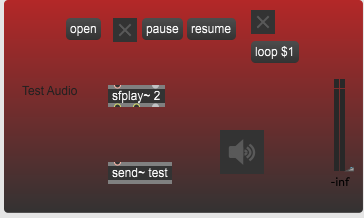
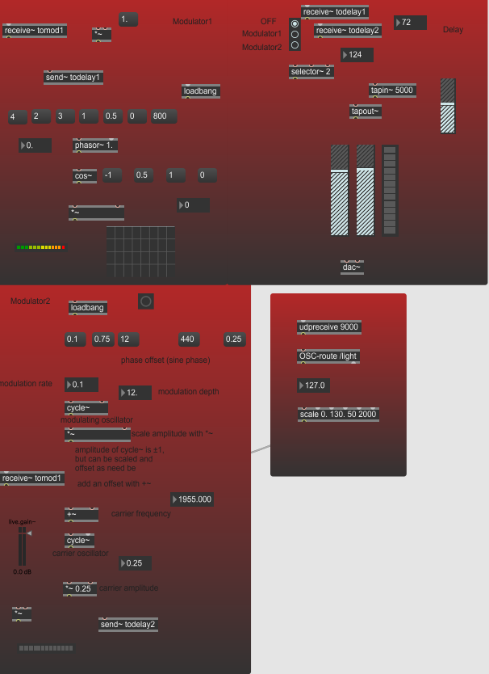

# Modulation/Delay effect for guitar
## (Instalare)
Pornind de [aici](https://cycling74.com/tutorials/max-5-guitar-processor-part-1) 
+[aici](https://music.arts.uci.edu/dobrian/maxcookbook/modulating-oscillator)+
[aici](https://docs.cycling74.com/max7/tutorials/15_delaychapter01) am creat un efect pentru
chitara - Guitar Effect.

## (Utilizare)

Am preluat partea de Input Handling de [aici](https://cycling74.com/tutorials/max-5-guitar-processor-part-1) si am mai adaugat 
partea de "Test Audio" pentru incarcarea unor trackuri in Max:

Semnalul audio este trecut prin niste filtre care pot fi selectate din dropdown bar:

Pornind de [aici](https://music.arts.uci.edu/dobrian/maxcookbook/modulating-oscillator) , am recreat un oscilator, pe care l-am modificat 
astfel incat frecventa semnalului generat sa varieze in functie de intensitatea luminii preluate de senzorul telefonului
(am folosit OSC hook). Prin selector, poate fi ales acest modulator("Modulator2") sau alt [modulator](https://cycling74.com/tutorials/lfo-tutorial-1-the-zen-of-the-silent-patch/)
("Modulator1"). 

In final, este implementat un efect de delay.

## (Istoric)

(13.05) Am ales sa implementez acest efect din toate functionalitatile pedalei. Pentru moment, partea de interactivitate va consta in inregistrarea live a unor trackuri cantate la chitara electrica+folosirea oscHook pe telefon. 
La o intensitate luminoasa slaba, aproape de 0, in max se va schimba LFO modulation, intr-o ordine anume. Setup-ul va fi ori ca in "Link 1" pentru a aplica live efectul, 
ori prin inregistrarea chitarii cu microfonul, si ascultarea output-ului in casti live sau ulterior inregistrarii.

(3.06) Voi folosi din aceasta pagina idei pentru efecte: 

https://cycling74.com/tutorials/max-5-guitar-processor-part-1 

De asemenea, voi folosi patch-ul GtrProcessor drept sursa de inspiratie pentru proiect.

(8.06) Am ales sa implementez un alt efect de chitara, ce contine modulatoare, filtre si un delay. 

## (Link-uri)
Link 1: https://cycling74.com/articles/expand-your-guitar-vol-1/

Link 2: https://music.arts.uci.edu/dobrian/maxcookbook/bandpass-filter-swept-lfo

Link 3: https://sites.uci.edu/computermusic/tag/modulation/
